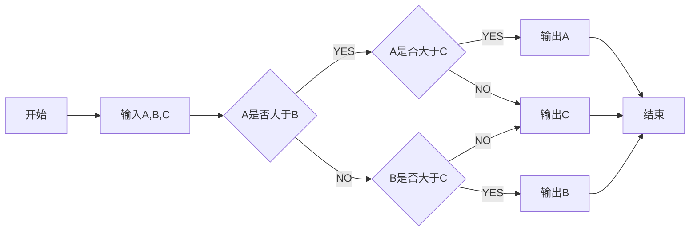

# Matlab-gui-for-Image-data-hiding-based-on-DCT-processing

1. main.m文件用来测试算法可靠性,将要测试的图片方案main.m同一文件夹下，并修改imread为要测试的文件名，包含后缀；
2. mainGui.m是运行GUI的主文件；
3. 使用GUI时需要注意，嵌入数据需要打开要嵌入的图片，嵌入的文本，目前仅支持ascii码，嵌入的密钥是随机生成的，在恢复图像和提取数据中需要用到；
4. 提取数据同样是先打开图像，输入嵌入数据时生成的密钥，点击按钮，即可得到嵌入的数据，以及恢复后的图像。
5. 本程序最开始设计未考虑到彩色图片的数据隐藏，目前仅支持黑白图片的数据隐藏。
看

# 插入流程

## 插入参数简述

本程序主要的算法思想是基于小波的数字图形隐藏算法。首先对图像进行小波变换，变换的系数矩阵为$8\times8$。设置相应的alpha，为插入系数，k1，k2分别为两个随机数组。其中$0<alpha<1, k1\in(1,8),k1(n)\in(0,1)$
即k数据为一行8列的一维数组，且每个元素都在（0，1)之间。

## 插入数据的流程

首先读取要插入的数据，假设要插入的数据为data,从头到尾遍历data。如果data当前二进制为为1,则
$k=k1$；否则$k=k2$

插入的公式为：
$$after(x+i,y+9-i)=before(x+i,y+9-i)+alpha\times k(i),i\in[1,8]$$

## 插入数据流程图

